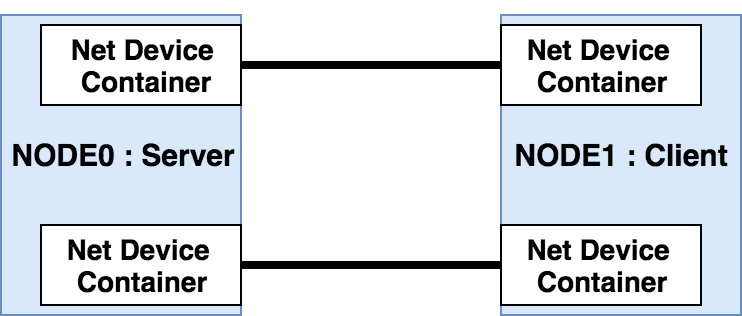

# MPTCP experiment.
ns-3.19(https://www.nsnam.org/)をベースにしてMultipath TCP[(RFC6824)](https://tools.ietf.org/html/rfc6824)のプロトコルが実装されたシミュレータ。


実験の想定イメージとして，2つのノード間に2本のリンクがある。


想定では2本のリンクの合計以下のスループットが得られるはずである。

リンクの転送速度，遅延時間やパケットロス率などをそれぞれに設定することで，ネットワークのスループットがどう変化するか検証する。


# 内容物
## myscripts
- single-path-mptcp.sh
    + 1本のリンクを持つトポロジでのシミュレーション
- run-simulation.sh
    + 2本のリンクを持つトポロジでのシミュレーション


## scratch
- mptcp.cc
    + Fork元の[mkheirkhah/mptcp](https://github.com/mkheirkhah/mptcp)で作られたシミュレーションシナリオ
- single-path-mptcp.cc
    + 単一リンクのシミュレーションで使用するシナリオ
- mptcp-delay-loss-simulation.cc
    + 2つのリンクで接続されたネットワークのシミュレーシオンシナリオ

## docs
README用の画像置き場。


## 書き換え箇所
ソースコード改変箇所

実験のために，パケットの到着時間をLOG出力するための機構を設定する。

以下のファイルに時刻を出力するコードを記述する。

src/applications/model/mp-tcp-packet-sink.cc

```
void
MpTcpPacketSink::HandleRead(Ptr<Socket> socket) {
    NS_LOG_FUNCTION (this << m_socket);
    Ptr<MpTcpSocketBase> mpSocket = DynamicCast<MpTcpSocketBase>(socket); uint32_t dataAmount = mpSocket->Recv(size);
    //uint32_t dataAmount = m_socket->Recv(buf, size);
    m_totalRx += dataAmount;
    NS_LOG_INFO ("MpTcpPacketSink:HandleRead() -> Received " << dataAmount << "
    Bytes total Rx " << m_totalRx); 
}
```
から
```
void
MpTcpPacketSink::HandleRead(Ptr<Socket> socket) {
    NS_LOG_FUNCTION (this << m_socket);
    Ptr<MpTcpSocketBase> mpSocket = DynamicCast<MpTcpSocketBase>(socket); uint32_t dataAmount = mpSocket->Recv(size);
    //uint32_t dataAmount = m_socket->Recv(buf, size);
    m_totalRx += dataAmount;
    NS_LOG_INFO (Simulator::Now().GetSeconds() << "
    MpTcpPacketSink:HandleRead() -> Received " << dataAmount << " Bytes total Rx " << m_totalRx);
}
```
